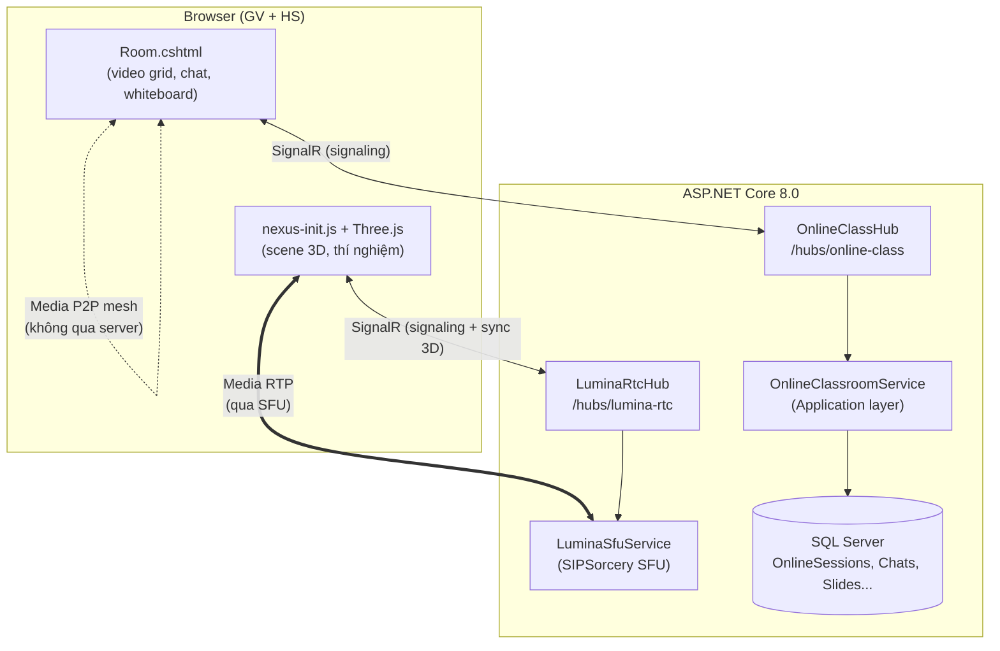
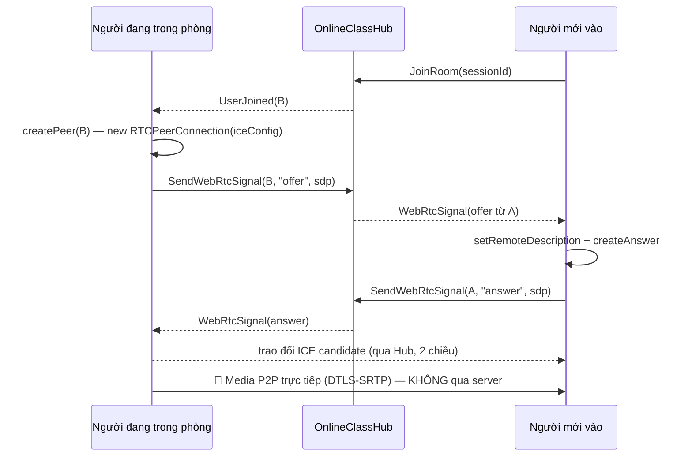
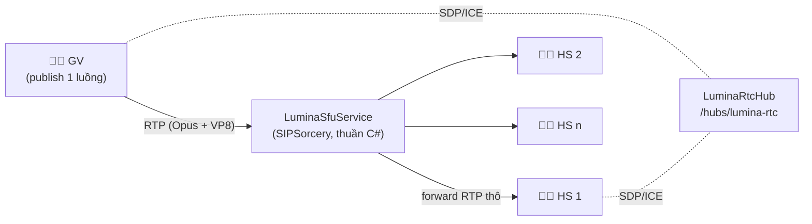

# Thuyết trình: Các bước xây dựng Phòng học Online & Phòng 3D (Lumina Nexus)

> Tài liệu trình bày từng bước làm ra 2 tính năng học trực tuyến của Lumina Tutors,
> bám đúng code thực tế trong repo. Dùng để thuyết trình / bảo vệ đồ án.

---

## 0. Bức tranh tổng thể

Hệ thống có **2 loại phòng học trực tuyến**, khác nhau về kiến trúc truyền media:

| Tiêu chí | Phòng học Online (2D) | Phòng 3D Lumina Nexus |
|---|---|---|
| Mục đích | Lớp học video call: cam/mic, chat, bảng trắng, slide, điểm danh, ghi hình | Phòng thí nghiệm ảo 3D: mô hình PBR, thí nghiệm Hóa/Lý/Sinh/Toán, spatial audio |
| Kiến trúc media | **WebRTC Mesh (P2P full-mesh)** — media đi thẳng browser ↔ browser | **SFU thuần C#** (SIPSorcery) — media đi browser ↔ server ↔ browser |
| Signaling | SignalR Hub `/hubs/online-class` | SignalR Hub `/hubs/lumina-rtc` |
| Render client | HTML/CSS + Canvas (whiteboard) | **Three.js** (ESM, importmap) |
| Controller | `OnlineClassroomController` | `LuminaNexusController` |
| Quyền truy cập | Policy `AnyAuthenticated` | Policy `LabAccess` + `[RequireFeature(PremiumFeature.VirtualLab)]` |
| Lưu DB | `OnlineSession`, `SessionParticipant`, `OnlineRoomChat`, `OnlineSlide`, `SessionRecording` | Trạng thái phòng giữ in-memory trong Hub; chỉ ghi hình lưu `SessionRecording` |

**Nguyên tắc chung cho cả 2 phòng:** SignalR chỉ là *control-plane* (tín hiệu, đồng bộ trạng thái); media audio/video là *media-plane* đi qua WebRTC (DTLS-SRTP), **không bao giờ đi qua Hub**.



---

# PHẦN A — PHÒNG HỌC ONLINE 2D (WebRTC Mesh + SignalR)

## Bước A1 — Thiết kế dữ liệu (Domain layer)

File: `src/LuminaTutors.Domain/Entities/Learning/Learning.cs`

Tạo 5 entity, tuân theo quy ước base class của dự án (`TenantEntity` có `SchoolId` cho multi-tenant):

```csharp
public class OnlineSession : TenantEntity        // buổi học online
{
    public int    TeacherId       { get; set; }
    public string Title           { get; set; }
    public string RoomCode        { get; set; }  // mã phòng "ABCD-1234"
    public OnlineSessionStatus Status { get; set; } = OnlineSessionStatus.Scheduled;
    public DateTime? ScheduledAt  { get; set; }  // lịch hẹn
    public DateTime? StartedAt    { get; set; }  // lúc phát phòng
    public DateTime? EndedAt      { get; set; }
    public int    MaxParticipants { get; set; } = 50;
    // Navigation: Participants, Chats, Slides
}
```

Các entity còn lại và vai trò:

| Entity | Vai trò |
|---|---|
| `SessionParticipant` | Ai vào phòng lúc nào (`JoinedAt`/`LeftAt`), đã điểm danh chưa (`IsAttended`, `AttendedAt`) |
| `OnlineRoomChat` | Tin nhắn chat trong phòng, lưu DB để xem lại lịch sử |
| `OnlineSlide` | Slide GV upload (FileUrl, TotalPages) để trình chiếu đồng bộ |
| `SessionRecording` | Metadata bản ghi hình (.webm). **Denormalized** (snapshot tên GV, nhãn phòng) — vì phòng 3D Nexus không có session trong DB nên không thể dùng khóa ngoại |

Vòng đời buổi học là một state machine đơn giản:

```
Scheduled ──Start()──► Live ──End()──► Ended
     └──Cancel()──► Cancelled
```

## Bước A2 — Migration (Infrastructure layer)

Cấu hình Fluent API đặt trong `Infrastructure/Data/Configurations/` (quy ước `IEntityTypeConfiguration<T>`), rồi tạo migration:

```powershell
dotnet ef migrations add AddOnlineClassroom --project src/LuminaTutors.Infrastructure --startup-project src/LuminaTutors.Web
dotnet ef database update  --project src/LuminaTutors.Infrastructure --startup-project src/LuminaTutors.Web
```

Ba migration thực tế trong repo: `20260528162224_AddOnlineClassroom` → `20260529000000_AddOnlineClassroomFull` → `20260616085132_AddSessionRecordings`.

## Bước A3 — Service nghiệp vụ (Application layer)

File: `src/LuminaTutors.Application/Services/OnlineClassroomService.cs`

Mọi method trả `Result<T>` (thông báo lỗi tiếng Việt), truy cập DB qua `IUnitOfWork`. Nhóm chức năng chính:

| Nhóm | Method | Ghi chú |
|---|---|---|
| CRUD buổi học | `GetSessionsAsync`, `GetByIdAsync`, `CreateAsync`, `UpdateAsync`, `DeleteAsync` | `CreateAsync` gọi `GenerateRoomCode()` sinh mã dạng `ABCD-1234` |
| Vòng đời | `StartSessionAsync`, `EndSessionAsync` | Đổi Status + đóng dấu StartedAt/EndedAt |
| Vào phòng | `JoinByCodeAsync` | HS nhập mã → validate: mã tồn tại (theo `SchoolId`), phòng chưa `Ended`, chưa đầy (`MaxParticipants`, không tính GV). Trả về trọn gói `JoinRoomResult`: thông tin phòng + danh sách người + 50 tin chat gần nhất + slides + cờ `IsHost` |
| Hiện diện | `RecordJoinAsync`, `RecordLeaveAsync` | Hub gọi khi user kết nối/rời — ghi `SessionParticipant` |
| Điểm danh | `MarkAttendanceAsync` | GV đánh dấu `IsAttended = true` ngay trong phòng |
| Chat | `SaveChatMessageAsync`, `GetChatHistoryAsync` | Lưu DB rồi mới broadcast |
| Slide | `UploadSlideAsync`, `GetSlidesAsync`, `DeleteSlideAsync` | File lưu `wwwroot/uploads` |

## Bước A4 — Controller + Views (Web layer)

File: `src/LuminaTutors.Web/Controllers/OnlineClassroomController.cs` — Views: `Views/OnlineClassroom/{Index, Create, Edit, Join, Room}.cshtml`

Luồng nghiệp vụ qua các action:

1. **GV tạo phòng**: `GET/POST Create` (`CreateOnlineSessionRequest`) → nhận mã phòng `ABCD-1234`.
2. **GV phát phòng**: `POST Start(id)` → Status = Live → redirect vào `Room(id)`.
3. **HS vào phòng**: `GET Join` (form nhập mã) → `POST JoinByCode(roomCode)` → service validate → redirect `Room(id)`.
4. **Trong phòng**: `Room(id)` render `Room.cshtml` — toàn bộ realtime từ đây do SignalR + WebRTC đảm nhiệm (bước A5–A6).
5. **Upload slide**: `POST UploadSlide(sessionId, IFormFile)`; **điểm danh/danh sách**: `Participants(sessionId)`.
6. **Kết thúc**: `POST End(id)` → Status = Ended, mọi client nhận sự kiện `SessionEnded` và tự thoát.
7. **Mobile**: `MobileEntry(roomCode, code)` — lối vào cho app mobile (lumina-mobile).

## Bước A5 — SignalR Hub: control-plane realtime

File: `src/LuminaTutors.Web/Hubs/OnlineClassHub.cs` — đăng ký trong `Program.cs`:

```csharp
builder.Services.AddSignalR();                          // dòng 129
app.MapHub<OnlineClassHub>("/hubs/online-class");       // dòng 287
```

Mỗi buổi học là một **SignalR Group** tên `session:{sessionId}`. Hub lấy `UserId`, `SchoolId` từ Claims (cookie auth) — client không tự khai danh tính được.

| Client gọi (server method) | Server phát (client event) | Chức năng |
|---|---|---|
| `JoinRoom(sessionId)` | `UserJoined` | Vào group + ghi DB `RecordJoinAsync` |
| `LeaveRoom(sessionId)` | `UserLeft` | Rời group + ghi DB |
| `SendMessage(sessionId, content)` | `ReceiveMessage` | Lưu DB trước, broadcast sau |
| `SyncWhiteboard(sessionId, strokeJson)` | `WhiteboardStroke` | Relay nét vẽ (không lưu DB) |
| `ClearWhiteboard(sessionId)` | `WhiteboardCleared` | Xóa bảng mọi máy |
| `SyncSlide(sessionId, slideId, page)` | `SlideChanged` | GV lật trang → HS lật theo |
| `SendWebRtcSignal(sessionId, targetUserId, type, data)` | `WebRtcSignal` | **Kênh signaling WebRTC** (offer/answer/ice-candidate) |
| `MarkAttendance(sessionId, studentUserId)` | `AttendanceMarked` | Điểm danh live |
| `RaiseHand` / `LowerHand` | `HandRaised` / `HandLowered` | Giơ tay phát biểu |
| `NotifySessionStarted/Ended` | `SessionStarted/Ended` | Đồng bộ vòng đời buổi học |

## Bước A6 — WebRTC Mesh: media-plane (trái tim của phòng học)

File: `src/LuminaTutors.Web/Views/OnlineClassroom/Room.cshtml` (~1.500 dòng, phần JS từ dòng ~850)

**Ý tưởng mesh:** mỗi người giữ một `RTCPeerConnection` tới *từng* người khác (`let peers = {}`). Media đi thẳng P2P, server chỉ chuyển hộ tín hiệu ban đầu.

Trình tự khi một người mới vào phòng:



Các điểm kỹ thuật quan trọng trong code:

1. **Lấy cam/mic** — `getUserMedia({video:true, audio:true})`, nếu bị từ chối video thì fallback audio-only. Chỉ chạy trên **HTTPS hoặc localhost** (ràng buộc của trình duyệt).
2. **ICE config do server bơm vào** — đọc từ `appsettings.json > Webrtc:IceServers` (mặc định STUN Google; thêm TURN khi HS ở mạng khác/NAT đối xứng).
3. **`createPeer(uid)`** — tạo `RTCPeerConnection`, gắn `onicecandidate → SendWebRtcSignal(..., 'ice-candidate', ...)`, `ontrack → gắn stream vào thẻ <video>` của người đó.
4. **Lọc tín hiệu phía client** — Hub broadcast `WebRtcSignal` cho cả group kèm `TargetUserId`; client tự bỏ qua nếu không phải gửi cho mình (giải pháp đơn giản cho bài toán map userId → connectionId).
5. **Toggle cam/mic/share màn hình** — dùng `pc.getSenders().find(...).replaceTrack(...)` để thay track không cần đàm phán lại.

> **Giới hạn của mesh:** n người = n×(n−1)/2 kết nối, mỗi máy upload (n−1) luồng. Thực tế ổn với ~6–8 người bật video. Đây chính là lý do phòng 3D chuyển sang SFU (Phần B).

## Bước A7 — Tính năng lớp học trên nền realtime

Tất cả xây trên cùng một Hub, chỉ khác payload: **chat** (lưu DB rồi broadcast — F5 không mất lịch sử), **bảng trắng** (canvas, stroke JSON relay qua `SyncWhiteboard`, không lưu DB), **trình chiếu slide** (GV upload PDF/ảnh → `SyncSlide` lật trang đồng bộ), **giơ tay** và **điểm danh live** (ghi thẳng `SessionParticipant.IsAttended`).

## Bước A8 — Ghi hình buổi học

1. Client dùng **MediaRecorder API** ghi màn hình/stream thành `.webm`.
2. Khi dừng → `POST RecordingController.Save` (multipart, giới hạn ~600 MB) kèm metadata: `source` (Online | Lab3D), `onlineSessionId?`, `roomLabel`, thời gian, số người tham gia.
3. Server lưu file vào `wwwroot/uploads/recordings/<guid>.webm` + tạo bản ghi `SessionRecording`.
4. Trang `Recording/Index` liệt kê để xem lại.

---

# PHẦN B — PHÒNG 3D "LUMINA NEXUS" (Three.js + SFU thuần C#)

## Bước B1 — Chọn kiến trúc: vì sao SFU thay vì mesh?

Phòng 3D cần: video GV đến *nhiều* HS + spatial audio + đồng bộ trạng thái 3D liên tục 20 lần/giây. Mesh sẽ nghẽn upload phía GV. Giải pháp: **SFU (Selective Forwarding Unit)** — mỗi người chỉ upload 1 luồng lên server, server *forward* (không transcode) đến người xem.



## Bước B2 — Controller + View toàn màn hình

File: `src/LuminaTutors.Web/Controllers/LuminaNexusController.cs` + `Views/LuminaNexus/Index.cshtml` (Layout = null)

1. Gác cổng bằng `[Authorize(Policy = "LabAccess")]` + `[RequireFeature(PremiumFeature.VirtualLab)]` (tính năng premium theo gói subscription).
2. Tự đoán môn dạy của GV qua hồ sơ (`SubjectTagMap`: hóa/lý/sinh/toán) để mở đúng thí nghiệm mặc định.
3. `BuildClientIceServersJson()` đọc `Webrtc:IceServers` → bơm xuống client, **dùng chung một bộ ICE với SFU**.
4. View bơm cấu hình vào JS qua object global:

```html
<script>
window.NEXUS_CONFIG = {
    roomId: '...', isTeacher: true|false, displayName: '...',
    subject: 'chemistry', initialScene: '...', iceServers: [...]
};
</script>
<script type="module" src="~/js/nexus/nexus-init.js"></script>
```

5. Nút mã phòng → copy link mời `/LuminaNexus?room=<mã>` cho HS.

## Bước B3 — SFU thuần C# bằng SIPSorcery

File: `src/LuminaTutors.Web/Hubs/LuminaSfuService.cs`

Đây là phần "khó" nhất — một SFU tự viết, không cần media server ngoài (Janus/mediasoup):

```csharp
public interface ILuminaSfuService
{
    Task<string> CreatePublisherAsync(string roomId, string connId, string sdpOffer);
    Task CreateSubscriptionAsync(string roomId, string subscriberConnId, string targetPeerId);
    void SetSubscriptionAnswer(string subscriptionId, string sdpAnswer);
    void AddIceCandidate(string pcKey, string candidateJson);
    void RemovePeer(string roomId, string connId);
}
```

Thiết kế cốt lõi:

1. **Mỗi publisher** = 1 `RTCPeerConnection` chiều **RecvOnly** (server *nhận* audio+video).
2. **Mỗi subscription** = 1 `RTCPeerConnection` chiều **SendOnly** (server *gửi* track của 1 publisher cho 1 người xem).
3. **Forward gói RTP thô**: `OnRtpPacketReceived → SendRtpRaw` cho mọi subscriber — **không transcode** nên CPU rất nhẹ.
4. **Codec cố định** để khỏi đàm phán phức tạp: Opus (PT 111, 48 kHz stereo) + VP8 (PT 96, 90 kHz).
5. SIPSorcery tự terminate **DTLS-SRTP** ở server; ICE servers đọc cùng config `Webrtc:IceServers`.

## Bước B4 — Signaling Hub + trạng thái phòng in-memory

File: `src/LuminaTutors.Web/Hubs/LuminaRtcHub.cs` — map tại `/hubs/lumina-rtc`

Hub giữ trạng thái phòng bằng các `ConcurrentDictionary` static (không cần DB vì phòng 3D là phiên tức thời):

| Store | Nội dung | Để làm gì |
|---|---|---|
| `Participants`, `Rooms` | Ai đang ở phòng nào | Roster, dọn dẹp khi disconnect |
| `RoomScenes` | Thí nghiệm hiện tại của phòng | Người vào sau mở đúng học cụ |
| `RoomChems` | Queue hóa chất đã đổ vào cốc | **Replay** thí nghiệm cho người vào sau |
| `RoomSims` | Tham số mô phỏng Lý/Sinh/Toán | Khôi phục đúng trạng thái slider |

Luồng chính: `JoinRoom(roomId)` → server trả `RoomJoined { selfId, role, scene, chem[], sims{}, peers[], roster[] }` → client dựng lại đúng hiện trường. GV bấm bật cam → `Publish(sdpOffer)` → SFU trả answer → mọi người nhận `NewPublisher` → từng HS gọi `Subscribe` để nhận luồng.

Bộ method đầy đủ của Hub (grep `public async Task` trong `LuminaRtcHub.cs`): media — `Publish`, `Subscribe`, `Answer`, `SendIceCandidate`; đồng bộ 3D — `SyncTransform` (client throttle **20 Hz**), `SyncLaser`, `SyncHighlight`, `SyncExplode`, `SyncLabels`, `SetScene`; thí nghiệm — `ChemAdd/ChemReset`, `SyncSim/SimReset`; lớp học — `SwitchMode` (Lecture ↔ Lab), `UpdateAvatar` (spatial audio), `RaiseHand/LowerHand`, `EndRoom`.

## Bước B5 — Engine 3D phía client (Three.js ESM)

Thư mục: `src/LuminaTutors.Web/wwwroot/js/nexus/` — nạp qua **importmap** (`"three": "/js/three/three.module.js"`), mỗi module một trách nhiệm:

| Module | Trách nhiệm |
|---|---|
| `nexus-init.js` | Bootstrap: ráp engine + hub + UI tablet; cache-bust `?v=N` đồng bộ giữa các module |
| `Lumina3DEngine.js` | Scene PBR (PMREM RoomEnvironment, sàn phản chiếu, RectAreaLight), specimen đa bộ phận: Highlight · Explode · nhãn CSS2D; GV xoay mô hình → sync, HS nội suy SLERP/LERP cho mượt |
| `LuminaStreamManager.js` | Publish/subscribe với SFU qua Hub; gắn `MediaStream` vào `<video>`; móc audio WebRTC vào `THREE.PositionalAudio` → **spatial audio** (đi xa GV nghe nhỏ dần) |
| `LuminaInteraction.js` | Laser pointer của GV + spatial audio helper |
| `LuminaChemLab.js` | Bàn phản ứng hóa: danh mục hóa chất theo SGK VN (KHTN 8–9, Hóa 10–12), DB phản ứng → hiệu ứng đổi màu, kết tủa, sủi bọt, cháy (Na + H₂O); có `restore(contents)` replay cho người vào sau |
| `LuminaSimLab.js` | Mô phỏng tương tác Lý/Sinh/Toán (bộ `SIMS`) |

## Bước B6 — Đồng bộ thí nghiệm realtime (pattern đáng thuyết trình nhất)

Ví dụ GV đổ HCl vào cốc:

1. GV click lọ HCl → client chạy animation + tra DB phản ứng → emit `ChemAdd('hcl')` lên Hub.
2. Hub **ghi vào `RoomChems` queue** rồi broadcast `RemoteChemAdd` cho HS.
3. HS nhận event → phát lại *đúng* animation (lọ bay lên, rót, đổi màu dung dịch).
4. HS vào muộn → `RoomJoined.chem = ['h2o','hcl',...]` → `restore()` phát lại tức thì không animation, ra đúng màu + kết tủa + phương trình cuối cùng.

Đây là pattern **event-sourcing thu nhỏ**: lưu chuỗi sự kiện thay vì trạng thái, người đến sau replay là ra đúng hiện trường.

---

# PHẦN C — CẤU HÌNH & TRIỂN KHAI

1. **ICE servers** (`appsettings.json`):

```jsonc
"Webrtc": {
  "IceServers": [
    { "urls": "stun:stun.l.google.com:19302" }
    // Production thêm TURN để vượt NAT đối xứng / mạng di động:
    // { "urls": "turn:your-turn-host:3478", "username": "USER", "credential": "PASS" }
  ]
}
```

2. **HTTPS bắt buộc** — `getUserMedia` chỉ chạy trên HTTPS/localhost. Dev: `https://localhost:60480`.
3. **STUN đủ cho demo cùng mạng LAN; TURN bắt buộc khi HS dùng 4G/mạng khác** (cả mesh 2D lẫn SFU 3D đều đọc chung config này).
4. **Chọn phòng nào?** Lớp video call thường ≤ 8 người bật cam → phòng 2D mesh (không tốn CPU server). Bài giảng thí nghiệm 1 GV → nhiều HS → Nexus SFU.
5. Chạy thử nhanh: `dotnet run --project src/LuminaTutors.Web` → đăng nhập GV → `/OnlineClassroom` (phòng 2D) hoặc `/LuminaNexus` (phòng 3D) → mở tab ẩn danh đăng nhập HS để join bằng mã.

---

# PHẦN D — KỊCH BẢN DEMO THUYẾT TRÌNH (5–7 phút)

1. **(30s)** Slide kiến trúc tổng thể: chỉ vào 2 đường đi của media (P2P mesh vs SFU) — nhấn mạnh "SignalR chỉ chở tín hiệu, không chở video".
2. **(1p)** GV tạo phòng online → hệ thống sinh mã `ABCD-1234` → bấm Start.
3. **(2p)** Mở trình duyệt thứ 2 vai HS → Join bằng mã → 2 bên thấy video nhau. Demo: chat (F5 vẫn còn — vì lưu DB), bảng trắng, giơ tay, GV điểm danh live.
4. **(30s)** Bấm ghi hình → dừng → mở trang Recordings cho thấy file .webm.
5. **(2p)** Mở `/LuminaNexus` vai GV → chọn thí nghiệm Hóa → đổ Na vào H₂O (hiệu ứng cháy) → phía HS thấy đúng animation. **Điểm nhấn:** cho HS thứ 2 vào muộn → hiện trường tự khôi phục đúng (replay queue).
6. **(30s)** Chốt: cùng một nền SignalR, hai kiến trúc media khác nhau theo đúng bài toán — mesh cho lớp nhỏ, SFU tự viết bằng C# cho streaming một-đến-nhiều.

---

## Phụ lục — Bản đồ file để mở nhanh khi bị hỏi

| Thành phần | File |
|---|---|
| Entity phòng online | `src/LuminaTutors.Domain/Entities/Learning/Learning.cs` (dòng ~303) |
| Service nghiệp vụ | `src/LuminaTutors.Application/Services/OnlineClassroomService.cs` |
| Controller 2D | `src/LuminaTutors.Web/Controllers/OnlineClassroomController.cs` |
| Hub 2D (signaling + chat + whiteboard) | `src/LuminaTutors.Web/Hubs/OnlineClassHub.cs` |
| Client 2D (WebRTC mesh) | `src/LuminaTutors.Web/Views/OnlineClassroom/Room.cshtml` |
| Controller 3D | `src/LuminaTutors.Web/Controllers/LuminaNexusController.cs` |
| Hub 3D (signaling + replay state) | `src/LuminaTutors.Web/Hubs/LuminaRtcHub.cs` |
| SFU thuần C# | `src/LuminaTutors.Web/Hubs/LuminaSfuService.cs` |
| Client 3D | `src/LuminaTutors.Web/wwwroot/js/nexus/*.js` |
| Ghi hình | `src/LuminaTutors.Web/Controllers/RecordingController.cs` |
| Đăng ký hub | `src/LuminaTutors.Web/Program.cs` (dòng ~287–289) |
| Cấu hình ICE | `src/LuminaTutors.Web/appsettings.json > Webrtc:IceServers` |
